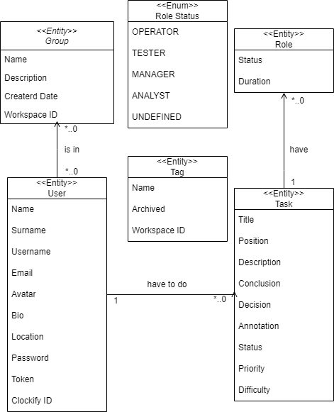

<div align="center">
<h1><a href="https://todolist-api2.herokuapp.com">TODOlist-API2<a></h1>
</div>
<div align="center">

</div>

# Index
* [Introduction](#Introduction)
* [Resources](#resources)
* [Operations](https://github.com/alesanfe/TODOlist-API2/wiki)

# Introduction
To check out URIs and request bodies, refer to our [SwaggerHub Page](https://todolist-api2.herokuapp.com/swagger-ui/).
Using the interactive documentation you will be able to check out URIs, response and request bodies...etc.

# Resources
Here is an overview of the resources Harmony offers in the form
of their response bodies and a short description of the relationship between them.
A basic schema of the organization is the next:
<div align="center">

</div>

## Task
The Task resource is used to create, retrieve, update, and delete tasks. If we're using this API to organise our projects on GitHub, it represents the repositories that our user have.

```json
{
  "annotation": "Some details that must be taken into account.",
  "description": "Explain the purpose of this task",
  "difficulty": "It could be SLEEP, EASY, MEDIUM, HARD, HARDCORE and I_WANT_TO_DIE",
  "duration": "Calculated using the start date and the end date-",
  "finishedDate": "The date that the task must be finished.",
  "idTask": "The id of the task",
  "priority": "It must be a number between 0 and 5 (0 not important, 5 very important).",
  "startDate": "The date that the task was started.",
  "status": "It could be DRAFT, IN_PROGRESS, IN_REVISION, DONE and CANCELLED",
  "title": "The title of the task"
}
```

## User
The User resource is used to create, retrieve, update, and delete users. I recommend that they're real users from GitHub.

```json
{
  "avatar": "The image that represents the user.",
  "bio": "Something about the user.",
  "email": "The email to contact the user.",
  "idUser": "The id of the user",
  "location": "Where the user lives.",
  "name": "The name of the user.",
  "surname": "The surname of the user.",
  "username": "The username of the user.",
  "password": "The password of the user (keep it in a safe place).",
  "token": "The token of the user will be used to get the repos or the info at GitHub.",
  "tasks": [ "The task that the user must completed." ]
}
```

## Group
The Group resource is used to create, retrieve, update, and delete groups. They can contain a group of users and assign to all of them a task or delete it.

```json
{
  "createdDate": "The date that the group was created.",
  "description": "Something about the group.",
  "idGroup": "The id of the group",
  "name": "The name of the group.",
  "numTasks": "The number of different tasks that the group have.",
  "users": [ "The users that belong to the group." ]
}
```
